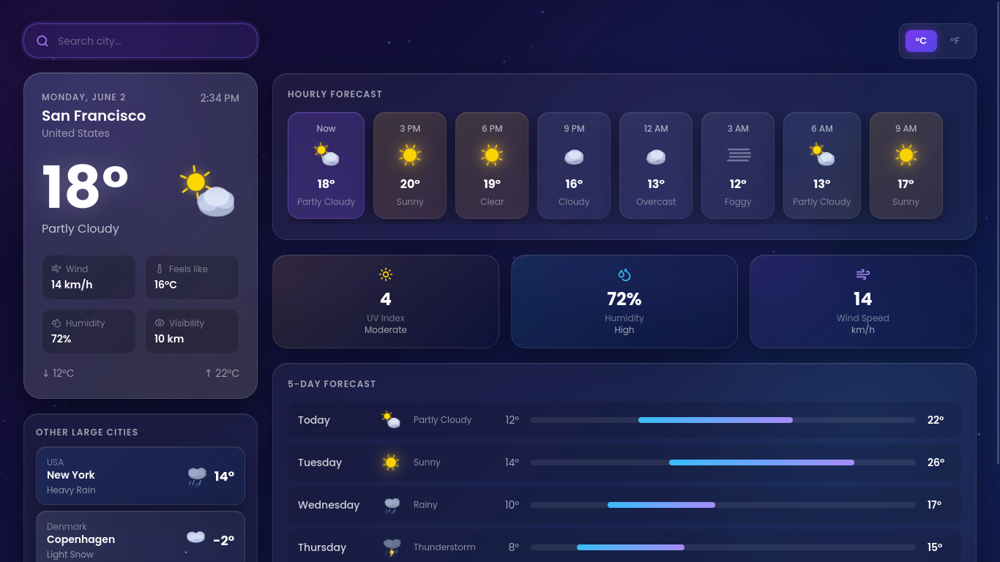

<p align="center">
  
</p>

<h1 align="center">Weather App</h1>

<p align="center">
  <strong>Aplicação de clima moderna</strong> • Dados em tempo real • HTML + CSS + JavaScript
</p>

<p align="center">
  <a href="#"><strong>Ver demo →</strong></a>
  <br><br>
  
  
  
  
</p>

---

### 🌤️ Sobre o Weather App

O **Weather App** é uma aplicação web que permite consultar o clima de qualquer cidade em tempo real, com uma interface simples, moderna e responsiva.

Principais funcionalidades:

* Busca de cidades em tempo real
* Exibição de temperatura, clima e localização
* Ícones dinâmicos de acordo com o clima
* Interface responsiva (mobile-first)
* Integração com API de clima

---

### 🌐 Demonstração

**[Acesse o site](#)**

---

### 🛠️ Tecnologias Utilizadas

* HTML5
* CSS3
* JavaScript (Vanilla)
* API de Clima (OpenWeatherMap)

---

### ⚙️ Funcionalidades

* 🌍 Pesquisa por cidade
* 🌡️ Temperatura atual
* ☁️ Condição climática (nublado, ensolarado, chuva, etc.)
* 📍 Localização do usuário (opcional)
* 🎨 Interface moderna com animações suaves

---

### 📁 Estrutura do Projeto

```
weather-app/
│
├── src/
│ ├── css/
│ │ └── style.css
│ │
│ ├── imgs/
│ │
│ └── script/
│ └── main.js
│
└── index.html
```


### 📄 Licença

Este projeto é livre para uso e modificação.

---

